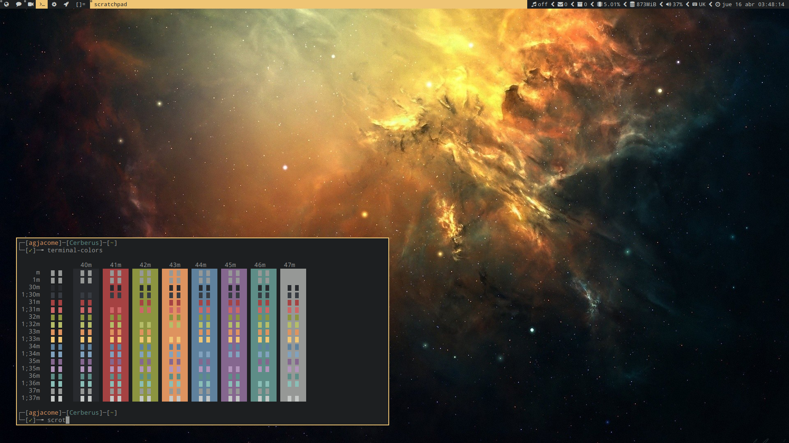

My own customized build of dwm
==============================



**[dwm](https://dwm.suckless.org/)** is an extremely fast tiling window manager
for X. This is my personal build of dwm, which includes the following patches:

* [attachaside](https://dwm.suckless.org/patches/attachaside/): make new
  clients appear in the stacking area instead of master
* [bottomstack](https://dwm.suckless.org/patches/bottomstack/): layout which
  puts the stacking area at the bottom
* [focusonclick](https://dwm.suckless.org/patches/focusonclick/): make clients
  focused only by mouse click and not only by mouse hover
* [gaplessgrid](https://dwm.suckless.org/patches/gaplessgrid/): layout which
  arranges all clients in a grid
* [push](https://dwm.suckless.org/patches/push/): move clients through the
  list with simple keybinds
* [scratchpad](https://dwm.suckless.org/patches/scratchpad/): spawn or restore
  a single floating terminal client
* [statuspadding](https://dwm.suckless.org/patches/statuspadding/): make
  horizontal and vertical padding of the statusbar configurable
* [uselessgap](https://dwm.suckless.org/patches/uselessgap/): add a
  configurable gap around clients for aesthetics purposes
* [viewontag](https://dwm.suckless.org/patches/viewontag/): follow clients to
  the tag they are being moved to

### Extra customizations

Apart from the patches, my current build is complemented with extra
customizations to other different programs and utilities:

* [dwmblocks](https://github.com/agjacome/dwmblocks): my own dwmblocks
  customization for the dwm statusbar

### Dependencies

* [nerd-fonts](https://www.nerdfonts.com/): the only font needed at the moment
  is `DroidSansMono Nerd Font`
* [rxvt-unicode](http://software.schmorp.de/pkg/rxvt-unicode.html): the build
  assumes a running `urxvt` daemon and an available `urxvtc` for creating
  client terminals
* [dmenu](https://tools.suckless.org/dmenu/): dynamic menu for X, used as
  application launcher
* Libraries: libx11, libxinerama, libxft and freetype2

### Installing on ArchLinux

All you need to do is download the `PKGBUILD` file from this repository and
build the ArchLinux package with `makepkg`:

```
curl -Ls https://raw.githubusercontent.com/agjacome/dwm/master/PKGBUILD > PKGBUILD
makepkg -scf
```

This will generate a package file that you will be able to install with
`pacman`:

```
sudo pacman -U dwm-agjacome*.pkg.tar.xz
```

### Installing on other Linux distributions

Download the source code from this repository and do a manual installation with
make:

```
git clone https://github.com/agjacome/dwm.git dwm-agjacome
cd dwm-agjacome
sudo make clean install
```
